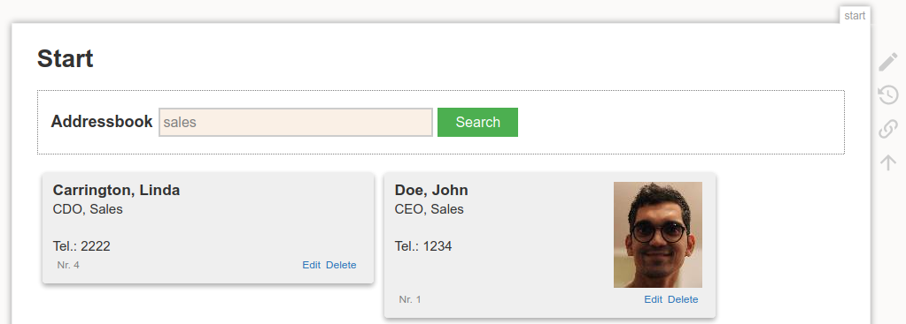
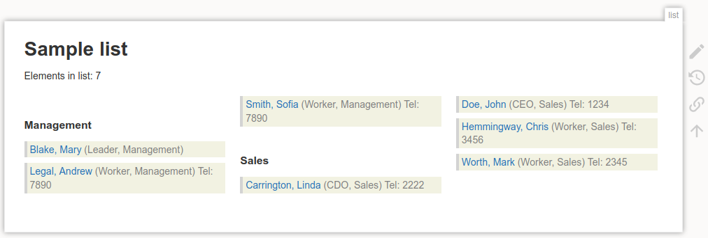
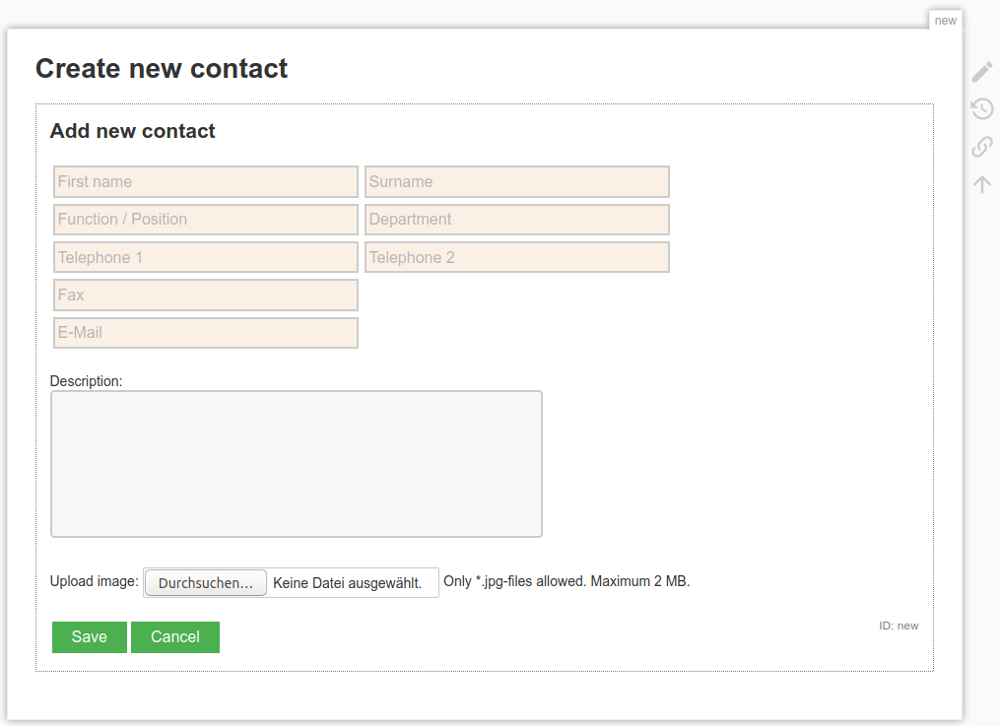

# Addressbook Plugin for DokuWiki

Adds an addressbook functionality to DokuWiki. The search results are also displayed on the standards search page.

The contacts are stored in a sqlite3-database. The [sqlite-plugin](https://www.dokuwiki.org/plugin:sqlite) ist required.

## Usage



```
[ADDRESSBOOK:search]
```
Adds a search bar to perform a fulltext search




```
[ADDRESSBOOK:index]
```
Lists all contacts.


  * ``[ADRESSSBOOK:index?departments]`` - Separate List by departments



```
[ADDRESSBOOK:addcontact]
```
Provides a form with which contacts can be added


```
[ADDRESSBOOK:contact=<nr>]
```
Show all information about a contact.


```
[ADDRESSBOOK:print<?option1&option2>]
```

Creates a printable list

  * ``[ADDRESSBOOK:print?department]`` - Separate contacts by department
  * ``[ADDRESSBOOK:print?select=<name>]`` - Show only contacts from department ``<name>``


## Settings

### Option 'search link target'

Contact search results are display on the search results page. In order to activate links to show or edit a contact, a page id must be stated, to which the link directs. This target page must contatin an ``[ADDRESSBOOK:]``-Tag for the request to performed.

### Option 'use ACL permissions'

Required access level ([ACL](https://www.dokuwiki.org/acl#background_info)) to edit the addressbook. The value 'no' uses the classic check: access via the setting of 'ismanager' in [$INFO](https://www.dokuwiki.org/devel:environment#info).

## Issues / Ideas

* Import and export CSV-Files
* Integration into DokuWikis search should be configurable
* Improve styling of the search box
* Add print styles for contact cards and the index list
* Improve index list showing specified amount of contacts with page flip
* Upload/Download sqlite3-file in admin section


## Compatibility

Tested with
* PHP / **7.3**
* DokuWiki / **Hogfather**
* [sqlite-plugin](https://www.dokuwiki.org/plugin:sqlite) / **2020-11-18**


## Data storage

The complete data (including the images as blobs) is stored ``data/meta/addressbook.sqlite3`` and can be backuped easily. An addressbook (sqlite3) with 1.000 contacts has a size of approximately 4.1 MB if every contact has a photo. The photo is scaled down and compressed, so it uses about 3-4kB. It is stored within the database as a blob (base64encoded).
